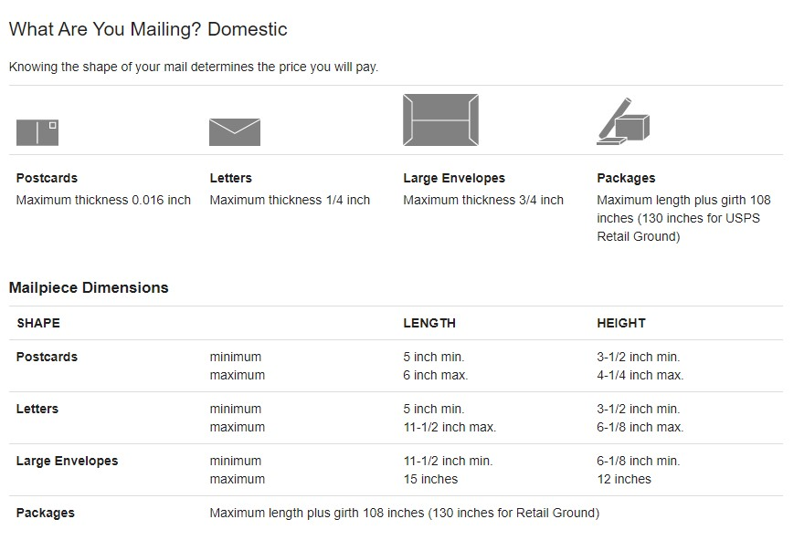
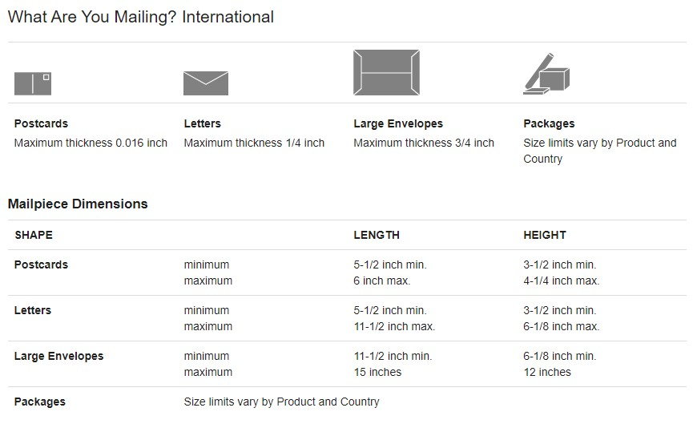

# EasyKeys.Shipping.Stamps.Rates

[](https://ci.appveyor.com/project/easykeys/easykeys-shipping)
[](https://www.nuget.org/packages?q=EasyKeys.Shipping.Stamps.Rates)

[](https://f.feedz.io/easykeys/core/packages/EasyKeys.Shipping.Stamps.Rates/latest/download)

## Give a Star! :star:

If you like or are using this project please give it a star. Thanks!

## Install

```bash
    dotnet add package EasyKeys.Shipping.Stamps.Rates
```

## Give a Star! :star:

If you like or are using this project please give it a star. Thanks!

## Install

```bash
    dotnet add package EasyKeys.Shipping.Stamps.Rates
```

## Usage

```csharp

    builder.Services.AddStampsRatesProvider();

    app.MapPost("/stamps/getRates", async (
    ShipmentDto model,
    IStampsRateProvider rateProvider,
    CancellationToken cancellationToken) =>
    {
        var listOfRates = new List<Rate>();

        var result = await GetShipmentRates(model, rateProvider, sender, receiver, null, cancellationToken);

        listOfRates.AddRange(result.SelectMany(x => x.Rates));

        return Results.Json(listOfRates, options);
    })

    public class ShipmentDto
    {
        public Address? Origin { get; set; }

        public Address? Destination { get; set; }

        public PackageDto? Package { get; set; }
    }

    static async Task<List<Shipment>> GetShipmentRates(
        ShipmentDto model,
        IStampsRateProvider rateProvider,
        ContactInfo sender,
        ContactInfo receiver,
        StampsServiceType? serviceType,
        CancellationToken cancellationToken)
    {
        // create a package
        var package = new Package(
            model!.Package!.Length,
            model.Package.Width,
            model.Package.Height,
            model.Package.Weight,
            model.Package.InsuredValue,
            model.Package.SignatureRequiredOnDelivery);

        var configurator = new StampsRateConfigurator(
            model.Origin!,
            model.Destination!,
            package,
            sender,
            receiver,
            serviceType,
            model.Package.ShipDate);

        var shipments = new List<Shipment>();

        foreach (var shipment in configurator.Shipments)
        {
            var result = await rateProvider.GetRatesAsync(shipment.shipment, shipment.rateOptions, cancellationToken);
            shipments.Add(result);
        }

        return shipments;
    }

```

## Rate Provider Details

Rate Provider Does the Following:

1. Makes a call to GetRates. Configurations of the rate request can be done in the RateRequestDetails class.
2. Adds all of the required AddOns in the response. All the AddOns specified here have to be included when
   requesting a shipping label.
3. Depending on if a signature is required, either "Signature Confirmation" or "Delivery Confirmation" services are added to the rates.
4. Rates are returned in the form of a list of Rate objects displaying the rate, service name, service description (including the package type), and delivery date.

## Additional Information

This response of this service hinges heavily on the package type that is requested (assuming the service type is unknown). For example,
if a package qualifies for first class & priority shipping but the package type requested is a flat rate type then **only priority rates** are returned.
On the other hand, if the package type is not a flat rate type, then the priority rates returned will not be the best rates.
Therefore two calls need to be made for a package qualifying for both first class and priority shipping, one with a non flat rate package type and another with a flat rate pacakge type.
This is all done automatically in **the stamps rate configurator**.

### Flat Rate Package Types

- FlatRateEnvelope
- PaddedFlatRateEnvelope
- LegalFlatRateEnvelope
- SmallFlatRateBox
- MediumFlatRateBox
- LargeFlatRateBox

## Dimensions

- https://pe.usps.com/text/dmm100/mailing-domestic.htm
  
- https://pe.usps.com/text/dmm100/mailing-international.htm
  
